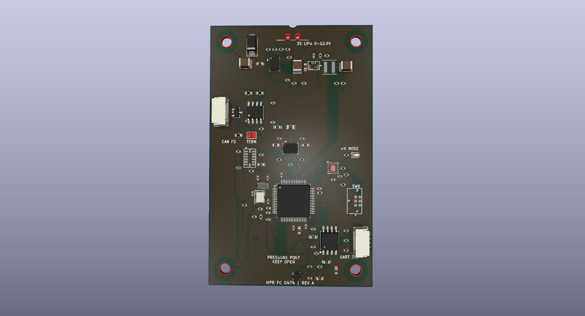

# InvictusOne Flight Computer

A 4-layer flight-data acquisition and logging board for high-power model rockets. The design combines a 3S LiPo power front end, an STM32G474 microcontroller, multiple flight sensors, non-volatile storage, CAN-FD and UART interfaces, and an external watchdog.

The board is intended to measure, timestamp, store, and communicate flight data. It does not include ignition, pyrotechnic, or recovery-deployment circuitry.

## Features

- STM32G474RET6 main controller with 8 MHz high-speed and 32.768 kHz low-speed crystals.
- BMI088 accelerometer and gyroscope, plus an ADXL375 high-g accelerometer with a measurement range up to ±200 g.
- LPS22DF absolute pressure sensor for pressure-based altitude estimation in application firmware.
- 128-Mbit (16-MiB) W25Q128 serial NOR flash for flight-data storage.
- CAN-FD transceiver with line protection and selectable 120 Ω termination.
- 3S battery input protection, electronic fuse, battery-current monitoring, and 3.3 V buck conversion.
- External watchdog connected to the MCU reset line.
- 29 test points on the bottom side.

## Specifications

| Item | Design specification |
|---|---|
| Battery input | 3S LiPo, 9.0–12.6 V nominal operating range |
| Battery protection | TPS25940 eFuse; nominal undervoltage rising/falling thresholds of about 8.67 V / 8.14 V, overvoltage cutoff about 13.53 V |
| Input current limit | About 1.74 A, set by the eFuse current-limit resistor |
| Main logic rail | 3.3 V from a TPS62902 synchronous buck converter |
| Sensor rails | 3V3_SENS and 3V3_BARO are ferrite-filtered branches of 3.3 V, not separate regulated outputs |
| Data storage | 128 Mbit / 16 MiB serial NOR flash |
| Communication | CAN-FD, 3.3 V UART, SWD |
| PCB outline | 50 × 80 mm |
| PCB construction | 4 copper layers, nominal 1.6 mm thickness |
| Mounting | Four 3.2 mm non-plated holes on a 40 × 70 mm pattern |
| Test access | 29 bottom-side test points |

Power thresholds and current limit are nominal resistor-based calculations. They are not per-cell LiPo protection thresholds or measured performance limits.

## Main components

| Reference | Part | Function |
|---|---|---|
| U1 | STM32G474RET6 | Main microcontroller; sensor acquisition, logging control, and communications |
| U2 | TPS3431SQDRBRQ1 | External watchdog; its output can reset the MCU |
| U3 | BMI088 | Accelerometer and gyroscope |
| U4 | ADXL375BCCZ | High-g accelerometer, ±200 g range |
| U5 | LPS22DFTR | Absolute pressure sensor |
| U6 | W25Q128JVSIQ | 128-Mbit serial NOR flash |
| U7 | TCAN3413DR | CAN-FD physical-layer transceiver |
| U8 | TPS25940AQRVCRQ1 | Input eFuse, voltage monitoring, current limiting, and current monitor |
| U9 | TPS62902QRYTRQ1 | Battery-to-3.3 V buck converter |
| U10 | PESD2CANFD24VT-Q | CAN bus transient protection |
| D2 | SMAJ13A-TR | Battery-input TVS diode |
| L1 | XGL4020-102ME, 1 µH | Buck-converter power inductor |

## Power and signal architecture

Battery power enters J1 as VBAT_RAW. The input TVS and eFuse feed VBAT_PROTECTED, which supplies the 3.3 V buck converter and is also available at J2 pin 1. The buck output is 3V3_MAIN. Ferrite filters create the 3V3_SENS branch for the inertial sensors, the 3V3_BARO branch for the pressure sensor, and a filtered VDDA branch for the MCU ADC.

The BMI088 uses SPI1, the ADXL375 uses SPI2, the pressure sensor uses I2C3, and the external flash uses SPI3. The MCU connects to the CAN-FD transceiver through FDCAN1, to J3 through USART2, and to a debug probe through SWD at J4. All board domains share a common ground; the sensor supply branches are filtered but not galvanically isolated.

See [Hardware design](docs/hardware-design.md) for the power path and design calculations, [Connector pinout](docs/pinout.md) for connector and test-point details, and [Programming and debug](docs/programming.md) for the custom SWD connection.

## External connectors

| Connector | Pin | Signal |
|---|---:|---|
| J1 — battery | 1 | VBAT_RAW, battery positive |
|  | 2 | GND |
| J2 — CAN module bus | 1 | VBAT_PROTECTED, battery voltage |
|  | 2 | GND |
|  | 3 | CAN_H |
|  | 4 | CAN_L |
| J3 — UART | 1 | 3V3_MAIN |
|  | 2 | GND |
|  | 3 | UART_TX from MCU |
|  | 4 | UART_RX to MCU |
| J4 — SWD | 1 | 3V3_MAIN / target reference |
|  | 2 | SWDIO |
|  | 3 | GND |
|  | 4 | SWCLK |
|  | 5 | GND |
|  | 6 | NRST |

**J2 pin 1 carries protected battery voltage, not 3.3 V.** J3 is a 3.3 V UART interface, not RS-232. J4 uses a custom six-contact assignment and is not the standard TC2030-CTX pinout. Confirm the pin numbering and cable wiring before connecting external equipment.

## Mechanical orientation

The board is 50 × 80 mm. The +X nose direction is marked on the silkscreen along the long board axis. The pressure-sensor port should remain unobstructed when installed. The four mounting holes are non-plated and form a 40 × 70 mm rectangle.

## Repository layout

- hardware/kicad/ — KiCad project, PCB, hierarchical schematic, design rules, and local symbol and footprint libraries.
- docs/schematic.pdf — rendered hierarchical schematic.
- docs/assets/board-overview.png — PCB layout illustration.
- docs/ — hardware overview, connector pinout, and programming guide.

## Opening the design

Open hardware/kicad/HPR_FC_G474_3S.kicad_pro in KiCad. The PCB, hierarchical schematic, local libraries, and design-rule file are kept together under hardware/kicad/; the project uses paths relative to that directory.

## Design boundaries

The board has no battery charger, cell balancer, individual-cell monitor, or guaranteed reverse-polarity protection. The eFuse monitors the pack input as a whole. Its nominal undervoltage threshold is below the safe minimum for some individual 3S LiPo cells, so it must not be used as cell-level protection.

The CAN interface is not galvanically isolated. The input TVS clamp can exceed the eFuse absolute-maximum input voltage under some surge conditions; validate the power source, wiring, and transient environment for the intended installation. This board is a sensing, logging, and communications platform, not a deployment controller.